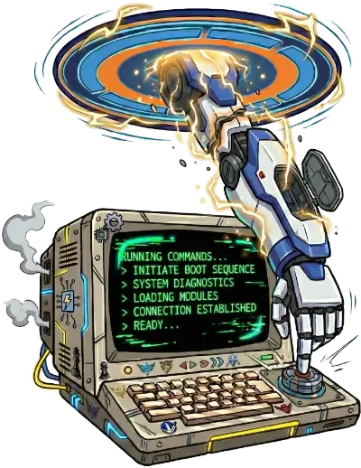

<p align="center">
  
</p>

<h1 align="center">@fcannizzaro/exocommand</h1>

<p align="center">
  An MCP server that exposes user-defined shell commands as tools for AI coding assistants.
</p>

[](https://github.com/fcannizzaro/exocommand/actions/workflows/publish.yaml)
[](https://www.npmjs.com/package/@fcannizzaro/exocommand)

## Overview

Exocommand lets you define a curated set of shell commands in a simple YAML file and makes them available to any [MCP](https://modelcontextprotocol.io)-compatible AI client. Instead of giving an AI agent unrestricted terminal access, you control exactly which commands it can discover and execute.

## Features

- **YAML configuration** -- Define commands in a `.exocommand` file with a name, description, and shell command.
- **Live reload** -- The server watches the config file for changes and notifies connected clients automatically.
- **Streaming output** -- By default, stdout and stderr are streamed line-by-line to the client via SSE in real time. If the server crashes mid-execution, the client retains all lines already received.
- **Task mode** -- Opt-in execution mode backed by the MCP experimental tasks API for crash-resilient, independently-pollable command execution.
- **Cancellation** -- Long-running commands can be cancelled by the client; the spawned process is killed immediately.
- **Multi-session** -- Uses the Streamable HTTP transport, supporting multiple concurrent MCP sessions.
- **Configurable port** -- Set via the config file, the `EXO_PORT` environment variable, or defaults to `5555`.

## Usage

Run the server in your project directory:

```bash
bunx @fcannizzaro/exocommand
```

> use `@fcannizzaro/exocommand@latest` to always run the latest version from npm

The server starts on `http://127.0.0.1:5555/mcp` by default.

> If no `.exocommand` file exists, the CLI will create a sample configuration file and exit. Edit the generated file with your own commands, then run the CLI again to start the server.

## Configuration

Create a `.exocommand` file in the project root (or set a custom path with the `EXO_COMMAND_FILE` env var):

```yaml
# Optional: override the default port
port: 4444

# Optional: enable task-based execution mode (default: false)
# taskMode: true

build:
  description: "Run the production build"
  command: "cargo build --release"

clippy:
  description: "Run clippy linter"
  command: "cargo clippy"

list-external:
  description: "List files in parent directory"
  command: "ls -a"
  cwd: ../
```

Each top-level key (except reserved keys like `port` and `taskMode`) is a command name. Names may contain letters, numbers, hyphens, and underscores.

| Field | Required | Description |
| --- | --- | --- |
| `description` | Yes | What the command does. |
| `command` | Yes | The shell command to run. |
| `cwd` | No | Working directory for the command. Relative paths are resolved from the server's working directory. |

### Environment Variables

| Variable | Description | Default |
| --- | --- | --- |
| `EXO_COMMAND_FILE` | Path to the `.exocommand` config file | `./.exocommand` |
| `EXO_PORT` | Server port (overrides config file) | `5555` |
| `EXO_TASK_MODE` | Enable task mode (`true` or `1`, overrides config file) | `false` |

### Execution Modes

The `execute` tool supports two execution modes:

**Streaming (default)** -- Each output line is sent as an SSE event on the response stream as it happens. The client receives lines in real time. If the server crashes mid-execution, all lines sent up to that point are already with the client. Cancellation works through the standard MCP request signal (client disconnect or `notifications/cancelled`).

**Task mode** -- Enabled via `taskMode: true` in the config file or `EXO_TASK_MODE=true`. Uses the MCP experimental tasks API. The server creates a background task, and clients can poll its status independently. Task-aware clients get full crash resilience (disconnect, reconnect, and resume polling). Supports structured cancellation via `tasks/cancel`.

## Safety

Remember to mount the `.exocommand` as read-only volume on Docker, to prevent the agent from modifying it.

If you have already use a script to start containerized agents, you can modify it to automatically mount the `.exocommand` file when present in the launch directory:

```bash
docker run \
  # ...
  $([ -f "$PWD/.exocommand" ] && echo "-v $PWD/.exocommand:$PWD/.exocommand:ro") \
  # ...
```

## Connecting an AI Client

Point any MCP-compatible client at the server's `/mcp` endpoint. For example, with [OpenCode](https://opencode.ai):

```json
{
  "mcp": {
    "exocommand": {
      "enabled": true,
      "type": "remote",
      "url": "http://host.docker.internal:5555/mcp"
    }
  }
}
```

The server exposes two tools:

| Tool | Description |
| --- | --- |
| `listCommands()` | Returns all available commands from the config file. |
| `execute(name, timeout?)` | Executes a command by name, streaming output back to the client. An optional `timeout` (in seconds) kills the process after the given duration and returns the buffered output. |

Remember to tell the agent that they can use these tools to run commands on the project. For example:

```
You can run predefined shell commands using the `listCommands()` and `execute(name, timeout?)` tools. Use `listCommands()` to see all available commands, and `execute(name, timeout?)` to run a specific command, with an optional timeout in seconds.
```

## License

[MIT](LICENSE)
