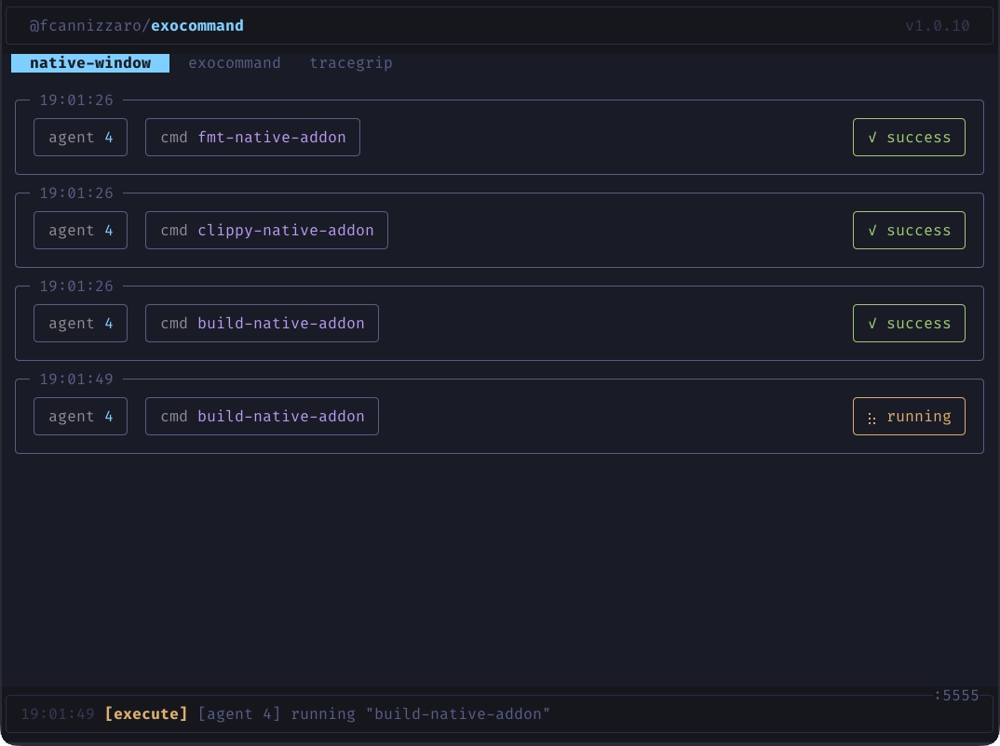

<p align="center">
  
</p>

<h1 align="center">@fcannizzaro/exocommand</h1>

<p align="center">
  An MCP server that exposes user-defined shell commands as tools for AI coding assistants.
</p>

[](https://github.com/fcannizzaro/exocommand/actions/workflows/publish.yaml)
[](https://www.npmjs.com/package/@fcannizzaro/exocommand)

## Overview

Exocommand is a centralized [MCP](https://modelcontextprotocol.io) server that manages multiple projects, each with its own set of shell commands defined in a `.exocommand` YAML file. Instead of giving an AI agent unrestricted terminal access, you register projects with the server and control exactly which commands each agent can discover and execute.

## Features

- **Multi-project registry** -- Register multiple projects, each with a unique access key. The server manages them all from a single process.
- **TUI dashboard** -- When running in a terminal, the server displays a real-time dashboard with project tabs, execution cards, status indicators, and animated spinners.
- **YAML configuration** -- Define commands per project in a `.exocommand` file with a name, description, and shell command.
- **Live reload** -- The server watches each project's config file for changes and notifies connected clients automatically.
- **Streaming output** -- By default, stdout and stderr are streamed line-by-line to the client via SSE in real time. If the server crashes mid-execution, the client retains all lines already received.
- **Task mode** -- Opt-in execution mode backed by the MCP experimental tasks API for crash-resilient, independently-pollable command execution.
- **Cancellation** -- Long-running commands can be cancelled by the client; the spawned process is killed immediately.
- **Multi-session** -- Uses the Streamable HTTP transport, supporting multiple concurrent MCP sessions across projects.

<p align="center">
  
</p>

## Quick Start

1. **Create a config file** in your project directory (skip if you already have one):

```bash
bunx @fcannizzaro/exocommand init
```

2. **Register the project** by pointing to a directory containing a `.exocommand` file (or to the file directly):

```bash
bunx @fcannizzaro/exocommand add .
```

This validates the config and prints an access key:

```
  ✓ Project registered

    Key     a1b2c3d4e5f6
    Header  exocommand-project: a1b2c3d4e5f6
    Config  /path/to/project/.exocommand
```

3. **Start the server:**

```bash
bunx @fcannizzaro/exocommand
```

> Use `@fcannizzaro/exocommand@latest` to always run the latest version from npm.

The server starts on `http://127.0.0.1:5555/mcp` by default.

4. **Connect an MCP client** with the `exocommand-project` header set to the access key (see [Connecting an AI Client](#connecting-an-ai-client)).

## CLI Commands

| Command | Description |
| --- | --- |
| `exocommand` | Start the MCP server. |
| `exocommand init` | Create a sample `.exocommand` config file in the current directory. Errors if the file already exists. |
| `exocommand add <path>` | Register a project. Accepts a directory (auto-resolves `.exocommand` inside it) or a direct file path. Validates the config and prints the access key. |
| `exocommand ls` | List all registered projects with their access keys and config paths. Missing configs are flagged. |
| `exocommand rm <key-or-path>` | Remove a project by its access key or filesystem path. |

- The registry is stored at `~/.exocommand/exocommand.db.json`.
- Access keys are 12-character hex strings.
- Re-adding an already registered path returns the existing key (no duplicates).

## Configuration

Create a `.exocommand` file in the project root:

```yaml
build:
  description: "Run the production build"
  command: "cargo build --release"

clippy:
  description: "Run clippy linter"
  command: "cargo clippy"

list-external:
  description: "List files in parent directory"
  command: "ls -a"
  cwd: ../
```

Each top-level key is a command name. Names may contain letters, numbers, hyphens, and underscores.

| Field | Required | Description |
| --- | --- | --- |
| `description` | Yes | What the command does. |
| `command` | Yes | The shell command to run. |
| `cwd` | No | Working directory for the command. Relative paths are resolved from the config file's directory. |

### Environment Variables

| Variable | Description | Default |
| --- | --- | --- |
| `EXO_PORT` | Server port | `5555` |
| `EXO_TASK_MODE` | Enable task mode (`true` or `1`) | `false` |

### Execution Modes

The `execute` tool supports two execution modes:

**Streaming (default)** -- Each output line is sent as an SSE event on the response stream as it happens. The client receives lines in real time. If the server crashes mid-execution, all lines sent up to that point are already with the client. Cancellation works through the standard MCP request signal (client disconnect or `notifications/cancelled`).

**Task mode** -- Enabled via `EXO_TASK_MODE=true`. Uses the MCP experimental tasks API. The server creates a background task, and clients can poll its status independently. Task-aware clients get full crash resilience (disconnect, reconnect, and resume polling). Supports structured cancellation via `tasks/cancel`.

## Connecting an AI Client

Point any MCP-compatible client at the server's `/mcp` endpoint. Clients must include the `exocommand-project` header with the project's access key on the initialize request.

For example, with [OpenCode](https://opencode.ai):

```json
{
  "mcp": {
    "exocommand": {
      "enabled": true,
      "type": "remote",
      "url": "http://host.docker.internal:5555/mcp",
      "headers": {
        "exocommand-project": "<access-key>"
      }
    }
  }
}
```

The server exposes two tools:

| Tool | Description |
| --- | --- |
| `listCommands()` | Returns all available commands from the project's config file. |
| `execute(name, timeout?)` | Executes a command by name, streaming output back to the client. An optional `timeout` (in seconds) kills the process after the given duration and returns the buffered output. |

Remember to tell the agent that they can use these tools to run commands on the project. For example:

```
You can run predefined shell commands using the `listCommands()` and `execute(name, timeout?)` tools. Use `listCommands()` to see all available commands, and `execute(name, timeout?)` to run a specific command, with an optional timeout in seconds.
```

## Safety

When running agents in Docker, mount `.exocommand` files as read-only volumes to prevent the agent from modifying them.

If you use a script to start containerized agents, you can automatically mount the `.exocommand` file when present in the launch directory:

```bash
docker run \
  # ...
  $([ -f "$PWD/.exocommand" ] && echo "-v $PWD/.exocommand:$PWD/.exocommand:ro") \
  # ...
```

## License

[MIT](LICENSE)
